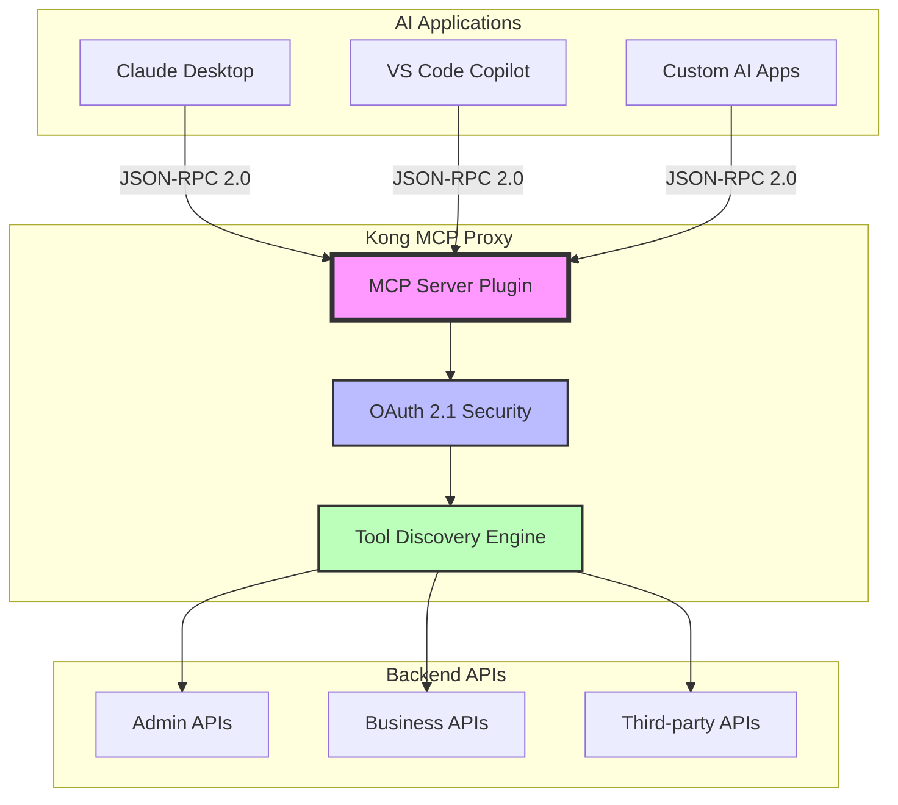
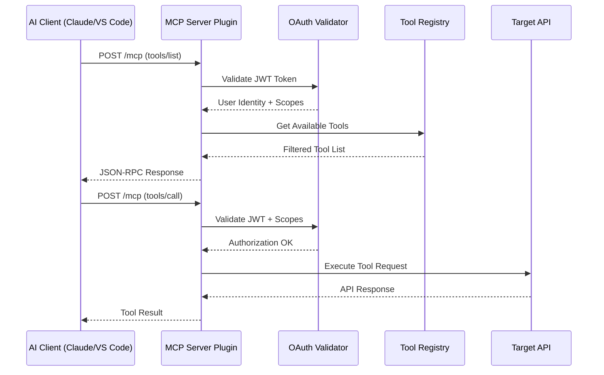
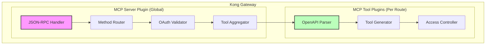
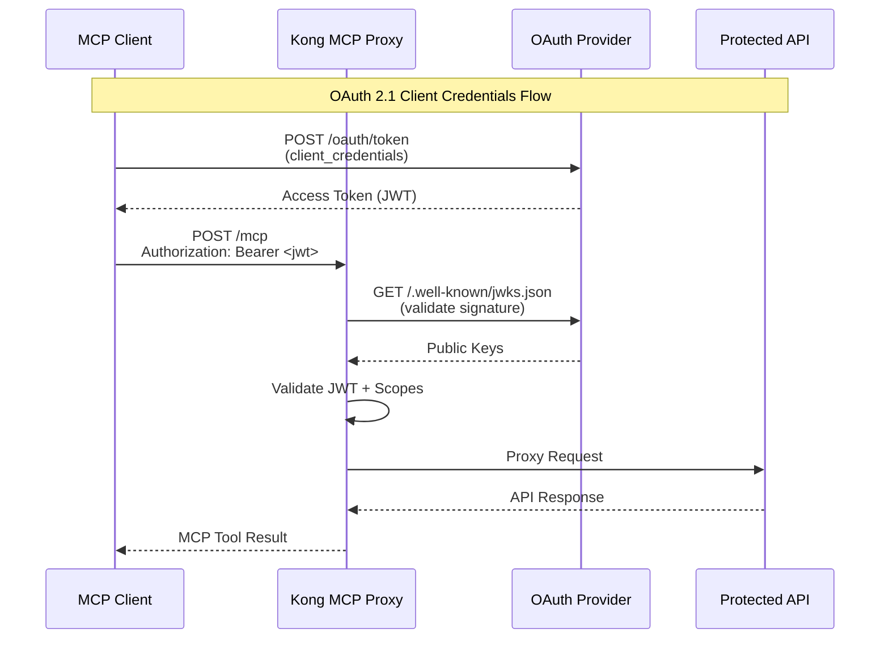

# Kong MCP Proxy - No-Code AI Tool Gateway 🚀

> **Hackathon POC**: Transform Kong Gateway into a no-code Model Context Protocol (MCP) proxy, enabling AI applications to discover and execute tools against Kong-proxied APIs through standardized JSON-RPC 2.0 interface.

## 🎯 The Big Idea

Imagine if you could take **any API** behind Kong Gateway and instantly make it available to AI applications like Claude, ChatGPT, or VS Code Copilot - without writing a single line of code. That's exactly what this Kong MCP Proxy does!



## 🌟 What Makes This Special

### Zero-Code API Exposure
- **Drop OpenAPI spec** → **Get MCP tools instantly**
- **No custom code required** - just Kong plugin configuration
- **Auto-generates tool definitions** from your existing API documentation

### Enterprise-Grade Security
- **OAuth 2.1/OIDC integration** with Auth0, Okta, and more
- **[Dynamic tool filtering](#-dynamic-tool-filtering-based-on-jwt-claims)** - users only see tools they're authorized to use
- **JWT validation** with RSA signature verification
- **Production-ready authentication**

### AI-Native Design
- **MCP Protocol compliance** - works with any MCP client
- **VS Code integration** tested and verified
- **Claude Desktop compatible**
- **Standardized JSON-RPC 2.0** interface

## 🚀 Quick Start

### 1. Environment Setup

Copy the environment template and configure:
```powershell
Copy-Item .env-template .env
```

Edit `.env` with your values:
```bash
# Konnect Configuration
KONNECT_TOKEN=your-konnect-personal-access-token
CONTROL_PLANE_NAME=mcp-test-local
CONTROL_PLANE_ID=your-control-plane-id

# Docker Configuration  
IMAGE_NAME=kong-mcp-plugin
CONTAINER_NAME=kong-mcp
```

### 2. Deploy Kong MCP Proxy

```powershell
# Register MCP plugin schemas with Konnect
.\deploy.ps1 -Action register-schemas

# Start Kong with MCP plugins
.\deploy.ps1 -Action start

# Deploy the sample configuration
.\deploy.ps1 -Action sync
```

### 3. Connect VS Code MCP Client

Configure your VS Code MCP client by adding to `.vscode/mcp.json`:
```json
{
    "servers": {
        "kong-local-mcp-plugin": {
            "url": "http://localhost:8000/mcp",
            "type": "http"
        }
    }
}
```

### 4. Test Your MCP Connection

```powershell
# Test tool discovery
$headers = @{ 'Content-Type' = 'application/json' }
$body = @{ 
    id = 1
    method = "tools/list"
    jsonrpc = "2.0" 
} | ConvertTo-Json

Invoke-RestMethod -Uri "http://localhost:8000/mcp" -Method Post -Body $body -Headers $headers
```

## 🏗️ Architecture Deep Dive

### System Flow



### Plugin Architecture



### OAuth Security Flow



## 🛠️ Configuration Examples

### MCP Server Plugin (Global)
```yaml
plugins:
- name: mcp-server
  config:
    server_name: "kong-mcp"
    server_version: "1.0.0"
    max_tools: 1000
    oauth:
      enabled: true
      jwks_uri: "https://dev-example.auth0.com/.well-known/jwks.json"
      audience: "mcp-gateway-api"
      issuer: "https://dev-example.auth0.com/"
      scope_filtering: true
      required_scopes: ["read:gateway"]
```

### MCP Tool Plugin (Per Route)
```yaml
plugins:
- name: mcp-tool
  config:
    tool_prefix: "admin_api"
    enabled: true
    api_specification: |
      {
        "openapi": "3.0.0",
        "info": { "title": "Admin API", "version": "1.0.0" },
        "paths": {
          "/status": {
            "get": {
              "summary": "Get Kong status",
              "operationId": "getStatus"
            }
          }
        }
      }
    access_control:
      default_requirements:
      - claim_name: "permissions"
        claim_values: ["admin:gateway", "read:gateway"]
        match_type: "any"
```

#### Tool Name Generation

The MCP tool plugin automatically generates tool names from your OpenAPI specification using this formula:

```
{tool_prefix}_{http_method}_{simplified_path}
```

**Components:**
- **`tool_prefix`**: From plugin config (falls back to route name if not specified)
- **`http_method`**: HTTP method in lowercase (`get`, `post`, `put`, etc.)
- **`simplified_path`**: OpenAPI path with `/` → `_`, parameters unwrapped (`{id}` → `id`)

**Examples:**
| OpenAPI Path | HTTP Method | tool_prefix | Final Tool Name |
|--------------|-------------|-------------|------------------|
| `/status` | GET | `admin_api` | `admin_api_get_status` |
| `/plugins/{id}` | GET | `kong_admin` | `kong_admin_get_plugins_id` |
| `/users/{userId}/posts` | POST | `api` | `api_post_users_userid_posts` |

> 🔧 **Tool names are sanitized** to MCP compliance: only `[a-z0-9_-]` characters allowed.

#### Tool Descriptions

The plugin uses OpenAPI specification fields to create tool descriptions that AI clients see:

1. **`summary`** field (preferred) → Tool description  
2. **`description`** field (fallback) → Tool description
3. **Auto-generated** (last resort) → `"{method_description} {path}"`

**Example:** 
```yaml
"/status":
  get:
    summary: "Get Kong status"        # ← This becomes the tool description
    description: "Detailed info..."   # ← Used if summary is missing
```

**Result:** AI clients see `"Get Kong status"` as the tool description, making it clear what the tool does.

## 📊 Environment Variables Reference

| Variable | Description | Example | Required |
|----------|-------------|---------|----------|
| `KONNECT_TOKEN` | Your Konnect Personal Access Token | `kpat_abcd1234...` | ✅ |
| `CONTROL_PLANE_NAME` | Konnect control plane name | `mcp-test-local` | ✅ |
| `CONTROL_PLANE_ID` | Control plane UUID | `59efe5f5-607d-4c75-...` | ✅ |
| `IMAGE_NAME` | Docker image name | `kong-mcp-plugin` | |
| `CONTAINER_NAME` | Docker container name | `kong-mcp` | |
| `ID` | Konnect cluster id (prefix before `.us.cp.konghq.com:443`) | `abcd123456` | ✅ |

### Getting Your Konnect Token
The token is used for registering custom plugins, and for executing deck commands.
1. Log into [Konnect](https://cloud.konghq.com)
2. Navigate to **Personal Access Tokens**
3. Create new token with `Control Planes Admin` permissions
4. Copy token to your `.env` file

## � Dynamic Tool Filtering Based on JWT Claims

One of the most powerful security features of Kong MCP Proxy is **dynamic tool filtering** based on JWT token claims. This ensures users only see and can execute tools they're authorized to access.

### How Tool Filtering Works

The MCP server plugin examines JWT claims (specifically the `permissions` array) and filters the available tools based on the access control requirements defined in each MCP tool plugin configuration.

### Real-World Example

With the sample deck configuration (`mcp-test-local.deck.yaml`), different users see different tools based on their JWT permissions:

#### User with Basic Gateway Access
**JWT Claims:**
```json
{
  "permissions": [
    "invoke:gateway",
    "read:gateway"
  ]
}
```

**Available Tools:** **6 tools** (Gateway endpoints only)
- `public_get_get` - HTTP GET test
- `public_get_status_200` - Return status 200  
- `public_post_post` - HTTP POST test
- `requestcatcher_get_root` - Capture GET request
- `requestcatcher_post_post` - Capture POST request
- `widgetarium_get_widgets` - List widget configurations

#### User with Kong Admin Access
**JWT Claims:**
```json
{
  "permissions": [
    "invoke:gateway",
    "kong:read", 
    "kong:write",
    "read:gateway"
  ]
}
```

**Available Tools:** **10 tools** (Gateway + Kong Admin)
- All 6 gateway tools from above, **PLUS:**
- `kong_admin_get_metrics` - Get Kong Prometheus metrics
- `kong_admin_get_plugins` - List Kong plugins
- `kong_admin_get_status` - Get Kong runtime status
- `kong_admin_post_plugins` - Create new Kong plugin

### Configuration Example

Here's how tool filtering is configured in the MCP tool plugin:

```yaml
plugins:
- name: mcp-tool
  config:
    tool_prefix: "kong_admin"
    access_control:
      default_requirements:
      - claim_name: "permissions"
        claim_values: ["kong:read", "kong:write"] 
        match_type: "any"  # User needs ANY of these permissions
```

### Security Benefits

- **Principle of Least Privilege**: Users only see tools they can actually use
- **Zero Trust Architecture**: Every tool access is validated against JWT claims
- **Audit-Ready**: All tool filtering decisions are logged for compliance
- **Flexible Permissions**: Support for complex claim matching (any/all requirements)
- **Dynamic Updates**: Tool visibility changes instantly when JWT permissions change

> 💡 **Pro Tip**: This filtering happens at tool discovery time (`tools/list`) AND execution time (`tools/call`), providing defense-in-depth security.

## �🔧 Available Commands

### Deployment Commands
```powershell
# Register plugin schemas with Konnect
.\deploy.ps1 -Action register-schemas

# Start Kong container with MCP plugins
.\deploy.ps1 -Action start

# Deploy configuration to Konnect
.\deploy.ps1 -Action sync

# Check system status
.\deploy.ps1 -Action status

# View container logs
.\deploy.ps1 -Action logs

# Stop Kong container
.\deploy.ps1 -Action stop
```

### Configuration Management
```powershell
# Pull current Konnect configuration
.\deploy.ps1 -Action dump

# Show configuration differences
.\deploy.ps1 -Action diff

# Clean up Docker resources
.\deploy.ps1 -Action clean
```

## 🧪 Testing Your MCP Tools

### Tool Discovery
```powershell
$body = @{
    jsonrpc = "2.0"
    id = 1
    method = "tools/list"
} | ConvertTo-Json

$response = Invoke-RestMethod -Uri "http://localhost:8000/mcp" -Method POST -Body $body -ContentType "application/json"
$response.result.tools | ForEach-Object { Write-Host $_.name }
```

### Tool Execution
```powershell
$body = @{
    jsonrpc = "2.0"
    id = 1
    method = "tools/call"
    params = @{
        name = "admin_api_getStatus"
        arguments = @{}
    }
} | ConvertTo-Json -Depth 3

Invoke-RestMethod -Uri "http://localhost:8000/mcp" -Method POST -Body $body -ContentType "application/json"
```

### With OAuth Authentication & Tool Filtering
```powershell
# Get OAuth token first
$tokenResponse = Invoke-RestMethod -Uri "https://your-auth0-domain.auth0.com/oauth/token" -Method POST -Body @{
    client_id = "your-client-id"
    client_secret = "your-client-secret"
    audience = "mcp-gateway-api"
    grant_type = "client_credentials"
} -ContentType "application/x-www-form-urlencoded"

# Use token in MCP request - tool list will be filtered based on JWT claims
$headers = @{ 'Authorization' = "Bearer $($tokenResponse.access_token)" }
$response = Invoke-RestMethod -Uri "http://localhost:8000/mcp" -Method POST -Body $body -Headers $headers -ContentType "application/json"

# Display filtered tools (count varies based on JWT permissions - see Tool Filtering section)
Write-Host "Available tools based on your permissions:"
$response.result.tools | ForEach-Object { Write-Host "- $($_.name): $($_.description)" }
```

> 🔐 **Security Note**: The number of tools returned depends on your JWT claims. See [Dynamic Tool Filtering](#-dynamic-tool-filtering-based-on-jwt-claims) for details on how permissions control tool visibility.

## 🎯 Hackathon Highlights

### 🏆 What Makes This a Winner

1. **Revolutionary Concept**: First Kong plugin to expose MCP protocol - creating a new category
2. **Zero-Code Solution**: Any API becomes AI-accessible without custom development
3. **Enterprise-Ready**: Production OAuth with [intelligent tool filtering](#-dynamic-tool-filtering-based-on-jwt-claims) and Kong-native architecture
4. **Real AI Integration**: Tested with VS Code Copilot and Claude Desktop
5. **Extensible Platform**: Foundation for advanced MCP features (resources, prompts, etc.)

### 🚀 Innovation Factors

- **Protocol Bridge**: First implementation bridging Kong Gateway with MCP ecosystem
- **AI-First Design**: Purpose-built for AI application integration
- **Security-First Approach**: OAuth 2.1 compliance with [dynamic tool filtering](#-dynamic-tool-filtering-based-on-jwt-claims) based on JWT claims
- **Developer Experience**: Simple configuration, powerful results
- **Future-Proof Architecture**: Ready for advanced MCP features

### 🎪 Demo Flow

1. **Show Problem**: Complex API integration for AI applications
2. **Reveal Solution**: Drop OpenAPI spec → Get MCP tools instantly  
3. **Live Demo**: VS Code connecting to Kong MCP proxy
4. **Security Demo**: [Dynamic tool filtering](#-dynamic-tool-filtering-based-on-jwt-claims) - watch tool count change based on JWT permissions!
5. **Scale Demo**: Multiple APIs exposed through single MCP endpoint

## 🔍 Technical Implementation Notes

### Architecture Decisions
- **HTTP Transport**: Native Kong request/response handling
- **Global + Route Plugins**: MCP server global, tools per route
- **OpenAPI-Driven**: Automatic tool generation from specifications
- **JWT-Based Security**: Industry-standard OAuth 2.1 implementation
- **Konnect Integration**: Designed for Kong's cloud platform

### Performance Considerations
- **Tool Caching**: In-memory registry for fast tool discovery
- **JWKS Caching**: 5-minute cache for OAuth key validation
- **Lazy Loading**: Tools loaded only when routes are accessed
- **Efficient Parsing**: Optimized OpenAPI to MCP conversion

### Security Model
- **Defense in Depth**: Multiple validation layers
- **[Dynamic Tool Filtering](#-dynamic-tool-filtering-based-on-jwt-claims)**: Tools filtered by JWT claims at discovery AND execution time
- **Signature Verification**: Full RSA cryptographic validation
- **Audit Trail**: Comprehensive logging for security monitoring

## 🚨 Important Notes

- **Hackathon Code**: While functional, this is POC-quality code - use at your own risk
- **Certificate Handling**: Dockerfile copies certs into image (not recommended for production)
- **Sample Configuration**: Replace placeholder values like "some-oauth.com" with real endpoints
- **Plugin Dependencies**: Uses Kong's mocking plugin - ensure availability in your Kong version

## 🎉 Ready to Transform APIs into AI Tools?

This Kong MCP Proxy represents a fundamental shift in how APIs become accessible to AI applications. By removing the complexity of custom integrations, we're democratizing AI-API interactions and creating new possibilities for intelligent automation.

**Get started now** and see how Kong Gateway becomes the ultimate AI tool gateway! 🚀

